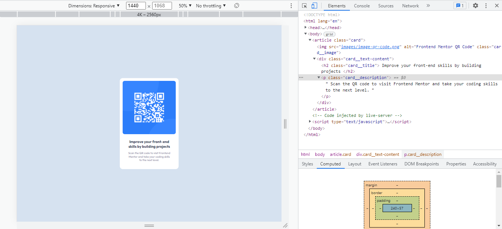

# Frontend Mentor - QR code component solution

This is a solution to the [QR code component challenge on Frontend Mentor](https://www.frontendmentor.io/challenges/qr-code-component-iux_sIO_H). Frontend Mentor challenges help you improve your coding skills by building realistic projects.

## Table of contents

- [Overview](#overview)
  - [Screenshots](#screenshots)
  - [Links](#links)
- [My process](#my-process)
  - [Built with](#built-with)
  - [What I learned](#what-i-learned)
  - [Continued development](#continued-development)
- [Author](#author)

**Note: Delete this note and update the table of contents based on what sections you keep.**

## Overview

### Screenshots




### Links

- Solution URL: [GitHub Repo](https://github.com/Marvin-Figueroa/QR-code-component.git)

## My process

### Built with

- Semantic HTML5 markup
- CSS custom properties
- CSS Grid
- Mobile-first workflow

### What I learned

I learned how to center the elements (vertically and horizontally) on the body of the page using CSS Grid.

```css
body {
  height: 100vh;
  display: grid;
  place-items: center;
}
```

### Continued development

- BEM CSS Architecture
- Making Layouts without including unnecessary elements.

## Author

- Github - [Marvin-Figueroa](https://github.com/Marvin-Figueroa)
- Frontend Mentor - [@Marvin-Figueroa](https://www.frontendmentor.io/profile/Marvin-Figueroa)
